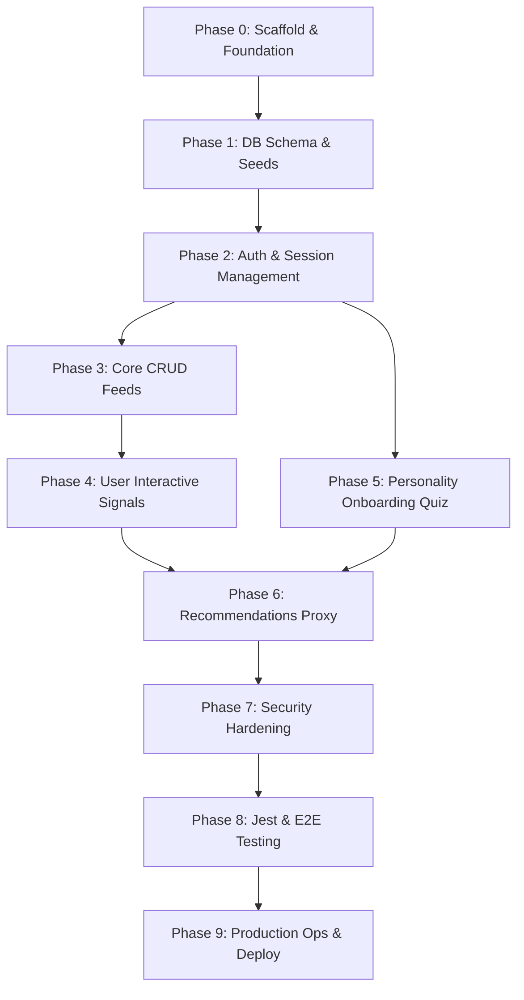

# Backend Implementation Phases Index

This directory contains the detailed documentation and checklists for the backend development phases of the **Heritage Hub** platform. 

The phases are structured to follow a logical progression: laying the foundation, configuring schemas, establishing security, implementing core content, adding interactive components, proxying AI engines, and finally hardening, testing, and deploying.

---

## 🗺️ Phases Roadmap

---

## 📂 Phase Breakdown & Documentation Links

### 🧱 Foundational Layer
1.  **[Phase 0: Scaffold & Setup](file:///c:/Users/HP/Heritage-Hub-Backend/doc/phases/phase-0-setup.md)**
    *   *Objective:* Set up the NestJS project skeleton, eslint configurations, public `/v1/health`, and the Unified Error Envelope filter.
2.  **[Phase 1: Data Layer & Migrations](file:///c:/Users/HP/Heritage-Hub-Backend/doc/phases/phase-1-data-layer.md)**
    *   *Objective:* Map out the 24+ database entities, standardizing names and creating polymorphic relation tables (nullable foreign keys) in PostgreSQL.
3.  **[Phase 2: Auth & Session Control](file:///c:/Users/HP/Heritage-Hub-Backend/doc/phases/phase-2-auth.md)**
    *   *Objective:* Standard JWT logins, Refresh Token Rotation (RTR) logic with automatic family invalidation, and custom ownership guards.

### 🏛️ Core Features Layer
4.  **[Phase 3: Core Domain CRUD](file:///c:/Users/HP/Heritage-Hub-Backend/doc/phases/phase-3-core-domain.md)**
    *   *Objective:* Expose pagination endpoints and timelines for Cities, Categories, Monuments, and Panoramas.
5.  **[Phase 4: User Interactions](file:///c:/Users/HP/Heritage-Hub-Backend/doc/phases/phase-4-user-interactions.md)**
    *   *Objective:* Secure routes for user feedback, reports, rating upserts, and notification status mutations.
6.  **[Phase 5: Personality Quiz](file:///c:/Users/HP/Heritage-Hub-Backend/doc/phases/phase-5-personality-quiz.md)**
    *   *Objective:* Onboarding quiz endpoints to derive and store the user's Travel Persona.

### 🤖 AI Proxy & Operations Layer
7.  **[Phase 6: Recommendations Proxy (Pattern A)](file:///c:/Users/HP/Heritage-Hub-Backend/doc/phases/phase-6-recommendations-proxy.md)**
    *   *Objective:* Establish REST channels, authorization wrappers, timeouts, and fallbacks to communicate with the external FastAPI service.
8.  **[Phase 7: Cross-Cutting Hardening](file:///c:/Users/HP/Heritage-Hub-Backend/doc/phases/phase-7-hardening.md)**
    *   *Objective:* Set up CORS parameters, rate limiters, input sanitizers, logging tracers, and OpenAPI Swagger documentation.
9.  **[Phase 8: Testing & Quality](file:///c:/Users/HP/Heritage-Hub-Backend/doc/phases/phase-8-testing.md)**
    *   *Objective:* Automate tests with Jest and Supertest, ensuring full route and schema safety.
10. **[Phase 9: Deployment & Ops](file:///c:/Users/HP/Heritage-Hub-Backend/doc/phases/phase-9-deployment.md)**
    *   *Objective:* Docker containerization, staging/production environment configs, CI/CD scripts, and database backup routines.
