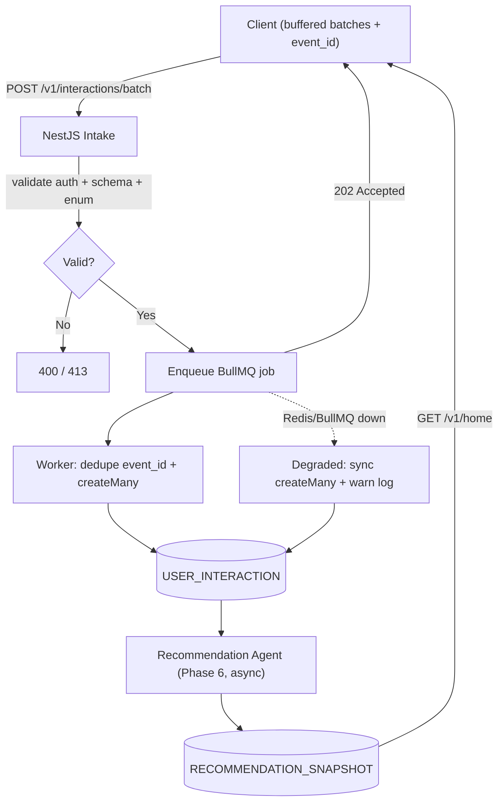

# User Interaction Telemetry — Plan

**Status:** Approved direction (pre-implementation)  
**Related:** [ADR-007](../adr/ADR-007-polymorphic-associations.md), [BACKEND_WORKFLOW.md](../../BACKEND_WORKFLOW.md), Phase 4 / Phase 6

---

## MVP vs Future

| | **MVP (build now)** | **Future (post-MVP)** |
|---|---|---|
| **Goal** | Capture passive browsing signals for the Recommendation Agent | Rich UX analytics, guest telemetry, ops-grade reliability |
| **Pipeline** | `POST /batch` → BullMQ → bulk insert | Redis Streams, DLQ, aggregation jobs |
| **Triggers** | Views, dwell, search via telemetry | `metadata` (zoom, pan), hotspot-level events |
| **Recommendations** | Triggered from telemetry **and** explicit APIs (favorites, quiz) | Real-time or near-real-time paths |
| **Failure handling** | BullMQ retries + log/skip; degraded sync DB fallback | Dead-letter queue, replay tooling, alerting |
| **Guests** | Auth required only | Anonymous session telemetry (guest-mode matrix) |
| **Retention** | 90-day raw retention (default) | Aggregate-then-purge, admin analytics (US-40) |

---

## 1. Scope & Goals

### In scope (MVP)

- Batch intake endpoint: `POST /v1/interactions/batch`
- Registered users only — `user_id` derived server-side from JWT
- Async pipeline: intake → **BullMQ** → worker → `USER_INTERACTION` bulk insert
- `event_id` dedupe for safe client retries (at-least-once delivery)
- Feed persisted interactions to the Recommendation Agent (Phase 6 reads the **table**, not Redis)

### Out of scope (MVP — deferred to Future)

- Guest telemetry
- Dead-letter queue (DLQ) and manual replay
- Redis Streams + consumer groups
- `metadata` object (zoom level, pan coordinates, etc.)
- Granular action types (`hotspot_open`, `media_view`, `share`, …)
- Triggering recommendations from the worker (use explicit API handlers for favorites/quiz)
- Real-time recommendation path
- Admin analytics dashboards (US-40)

---

## 2. End-to-End Flow (MVP)



**Narrative:** The client buffers events locally and flushes batches. The intake handler validates auth, schema, and enums, enqueues to BullMQ, and returns `202 Accepted` without blocking on PostgreSQL. A worker deduplicates on `event_id` and bulk-inserts into `USER_INTERACTION`. Phase 6 reads the persisted table asynchronously and writes `RECOMMENDATION_SNAPSHOT`, which the client reads via `GET /v1/home`.

**Recommendation triggers (MVP):**

| Source | When to refresh recommendations |
|---|---|
| Telemetry | After `view_monument`, `view_city`, `view_panorama`, `search` persisted |
| `POST /v1/favorites` | On add favorite — do **not** duplicate in telemetry |
| `POST /v1/personality/quiz/submit` | On quiz complete — do **not** duplicate in telemetry |

---

## 3. Intake API Contract (MVP)

### `POST /v1/interactions/batch`

| Property | Value |
|---|---|
| Auth | Bearer token (registered users). `user_id` resolved server-side — never from client. |
| Request body | `{ "events": [ Event, ... ] }` |
| Max batch size | 50 events (oversized → `413 Payload Too Large`) |
| Success | **`202 Accepted`** — receipt acknowledged; persistence is async |
| Errors | `400` (schema/enum invalid), `401` (no/invalid token), `413` (batch too large) |
| Rate limit | 30 requests/minute per user |

### Event shape (MVP)

```json
{
  "events": [
    {
      "event_id": "550e8400-e29b-41d4-a716-446655440001",
      "action_type": "view_monument",
      "entity_type": "monument",
      "entity_id": "550e8400-e29b-41d4-a716-446655440000",
      "occurred_at": "2026-06-24T12:00:00.000Z",
      "duration_seconds": 45
    }
  ]
}
```

| Field | Type | Required | Notes |
|---|---|---|---|
| `event_id` | uuid | yes | Client-generated; dedupe key for retries |
| `action_type` | enum | yes | Closed set — see §4 |
| `entity_type` | enum | yes | `city` \| `monument` \| `panorama` |
| `entity_id` | uuid | yes | Soft reference (ADR-007 string-based log) |
| `occurred_at` | ISO 8601 | yes | When it happened on device (batching delays) |
| `duration_seconds` | int | conditional | Required when action carries duration — see §4 |

Server sets `user_id` from JWT and `created_at` on persist. Client never sends either.

**Batch validation:** Invalid events in a batch are rejected individually; valid ones are still accepted. Response:

```json
{
  "data": {
    "accepted": 12,
    "rejected": 0
  }
}
```

---

## 4. Event Types — `action_type` enum (MVP)

Scoped to what the Recommendation Agent needs (US-22). Unknown values rejected at intake — never silently stored.

| action_type | `duration_seconds` | Typical trigger |
|---|---|---|
| `view_monument` | Required | Monument detail / panorama page dwell |
| `view_city` | Required | City detail page dwell |
| `view_panorama` | Required | 360° panorama session |
| `search` | Omit | User performed a search |
| `view_home` | Omit | Home feed viewed (optional MVP signal) |

> **Not in telemetry (MVP):** `add_favorite`, `complete_quiz` — handled by their respective API endpoints, which enqueue recommendation refresh directly.

Align Prisma `InteractionActionType` enum with this list when implementing (update ADR-007 reference).

---

## 5. Auth Rules

- **MVP:** registered users only. Valid bearer token required.
- **Never trust client-supplied identity** — no `user_id` in request body.
- **Future (guest mode):** resolve association at intake (ephemeral device/session id); event shape unchanged. Must respect US-03 (no PII for guests). See [guest-mode-route-matrix.md](../guest-mode-route-matrix.md).

---

## 6. Client Batching Strategy (MVP)

| Rule | Value |
|---|---|
| Flush interval | Every **5 seconds** while screen is active |
| Max batch size | **20 events** per flush (under server cap of 50) |
| Flush on background | App backgrounded → flush immediately |
| Local persistence | Buffer survives app kill/crash |
| Retry | Exponential backoff + jitter; safe because of `event_id` dedupe |
| Offline overflow | Max **200** events locally; drop oldest on overflow |
| Max retries | Drop after N failures so a dead backend cannot grow buffer unbounded |

---

## 7. Pipeline — BullMQ → `USER_INTERACTION` (MVP)

### Intake handler

- Minimal validation: auth, schema, enum only
- Push payload to BullMQ queue `interactions-ingest`
- Return `202` immediately — **no DB write on the happy path**

### Worker

- Consume jobs from `interactions-ingest`
- Dedupe on `event_id` (`createMany` + `skipDuplicates` or unique index on `event_id`)
- Bulk-insert into `USER_INTERACTION`
- On per-event validation failure (rare post-intake): **log warning + skip** — no DLQ

### Failure modes (MVP)

| Failure | Behavior |
|---|---|
| Invalid at intake | `400` — reject at HTTP layer |
| BullMQ enqueue fails | **Degraded mode:** synchronous `createMany` in handler + warning log. Do not silently drop. |
| Worker DB insert fails | BullMQ retries (3×, exponential backoff). After exhaustion: log error; job visible in BullMQ failed set. |
| Bad event at worker | Log + skip — **no DLQ** |

> **Why no DLQ for MVP:** No ops team or replay tooling yet. BullMQ's built-in failed-job visibility is sufficient. Add a formal DLQ in Future when traffic and monitoring justify it.

> **Why BullMQ, not Redis Streams:** Already in the stack (`BACKEND_WORKFLOW.md`), native NestJS support (`@nestjs/bullmq`), simpler than Streams + consumer groups for MVP.

---

## 8. Storage Model

Uses `UserInteraction` from ADR-007:

- `entityType` + `entityId` — string-based soft reference
- `actionType` — Prisma enum matching §4
- `durationSeconds` — nullable
- `userId` — from JWT
- `createdAt` — server timestamp on persist

**Dedupe:** unique index on `event_id` (add column to model at implementation).

**Retention (MVP default):** raw events kept **90 days**; purge via scheduled job. Revisit aggregation before prod App Store / Play Store privacy review.

---

## 9. Relationship to Phase 6 Recommendations

- `USER_INTERACTION` is the **feature source** for passive browsing signals
- Recommendations **read from PostgreSQL**, not the live queue
- Agent runs **asynchronously** — a few seconds of pipeline lag is acceptable (US-22)
- Agent writes `RECOMMENDATION_SNAPSHOT`; client reads via `GET /v1/home`
- Explicit user actions (favorite, quiz submit) trigger refresh from their **service layer**, not duplicated in telemetry

---

## 10. Module Placement (MVP)

```
src/modules/interactions/
├── interactions.module.ts
├── interactions.controller.ts
├── interactions.service.ts           # enqueue + degraded sync fallback
├── processors/
│   └── interaction-ingest.processor.ts
└── dto/
    └── interaction-batch.dto.ts
```

**Phase assignment:** Build in Phase 4 (alongside feedback) or early Phase 6 — before recommendations need signals.

---

## 11. Privacy & Security

- No PII in events (no search query text in MVP — only `search` action signal)
- Auth required (MVP)
- Throttled per user
- Append-only — no client delete
- Retention window enforced (90 days default)

---

## 12. Acceptance Criteria (MVP)

- [ ] `POST /v1/interactions/batch` returns `202` with accepted/rejected counts
- [ ] Events appear in `user_interaction` within 10s under normal load
- [ ] Duplicate `event_id` on retry does not create duplicate rows
- [ ] Unknown `action_type` returns `400` with unified error envelope
- [ ] Unauthenticated request returns `401`
- [ ] BullMQ unavailable → degraded sync insert succeeds with warning log
- [ ] Worker failure retries 3× then surfaces in BullMQ failed jobs

---

## 13. Future Plan (post-MVP)

When traffic, guest mode, or ops maturity justify it:

| Enhancement | When / why |
|---|---|
| **Guest telemetry** | Guest mode ships — ephemeral session id at intake |
| **`metadata` field** | AI needs zoom/pan/hotspot granularity — `{ "zoom_level": 3 }` etc. |
| **Granular action types** | `hotspot_open`, `media_view`, `share` for richer models |
| **Redis Streams** | Need replay after consumer crash without re-reading DB |
| **Dead-letter queue** | Ops team + monitoring; manual replay of poison messages |
| **Real-time recommendations** | Product requires sub-second "For You" updates |
| **Aggregation jobs** | Roll raw events into daily summaries; shorten retention |
| **Admin analytics (US-40)** | Separate read consumer on same table |
| **Retention policy** | Formal privacy review; aggregate-then-purge |

Future additions must be **additive** — do not break the MVP event contract (`event_id`, `action_type`, `entity_type`, `entity_id`, `occurred_at`).

---

## 14. Open Questions (resolve before prod)

1. **Enum completeness:** Confirm with AI/recommendations owner that five MVP `action_type` values are sufficient for Phase 6.
2. **Retention:** 90-day default acceptable for privacy policy? Legal review before store submission.
3. **Postman collection:** Add `POST /v1/interactions/batch` to Heritage-Hub-API collection.

---

## 15. Affected Artifacts

- [api-endpoint-contract.md](../api-endpoint-contract.md) — canonical MVP routes (`POST /v1/interactions/batch`)
- [project-features-arch.md](../project-features-arch.md) — Feature 15
- [ADR-007](../adr/ADR-007-polymorphic-associations.md) — update `InteractionActionType` enum at implementation
- Heritage-Hub-API Postman collection
